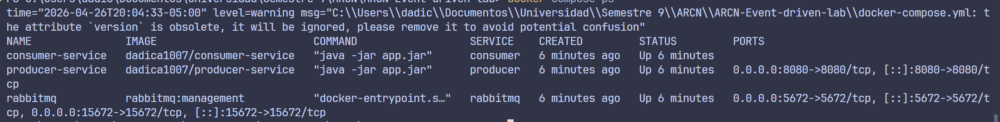
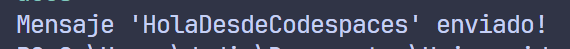
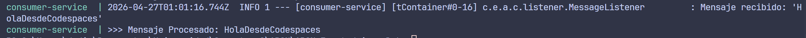

# Laboratorio: Microservicios con Spring Boot, RabbitMQ y Docker Compose

Este laboratorio implementa dos microservicios Spring Boot, uno productor y uno consumidor, que se comunican mediante RabbitMQ y se ejecutan con Docker Compose.

## Objetivo

Crear un flujo simple de mensajería asíncrona:

1. El servicio productor expone un endpoint REST para enviar mensajes.
2. RabbitMQ recibe y enruta los mensajes.
3. El servicio consumidor escucha la cola y procesa cada mensaje.
4. Todo se ejecuta en un entorno online gratuito, usando GitHub Codespaces como opción recomendada para probar.

## Estructura del repositorio

```text
event-driven-lab/
├── producer-service/
│   ├── src/
│   ├── pom.xml
│   └── Dockerfile
├── consumer-service/
│   ├── src/
│   ├── pom.xml
│   └── Dockerfile
├── .devcontainer/
│   └── devcontainer.json
├── docker-compose.yml
└── README.md
```

## Requisitos

- Java 17
- Maven
- Docker
- GitHub Codespaces o una máquina local con Docker Compose
- Cuenta en Docker Hub si vas a publicar imágenes

## Arquitectura

- Producer: expone `POST /api/messages/send?message=...`
- RabbitMQ: cola `messages.queue`, exchange `messages.exchange`, routing key `messages.routingkey`
- Consumer: escucha `messages.queue` y registra el mensaje recibido

## Opción recomendada: GitHub Codespaces

Esta es la forma más simple de probar el laboratorio porque todo corre en el mismo entorno.

### 1. Abrir el repositorio en Codespaces

1. En GitHub, abre el repositorio.
2. Haz clic en `Code`.
3. Ve a la pestaña `Codespaces`.
4. Selecciona `Create codespace on main`.

La configuración de [.devcontainer/devcontainer.json](.devcontainer/devcontainer.json) prepara Java, Maven y Docker.

### 2. Levantar los servicios

Desde la raíz del repositorio:

```bash
docker compose up -d
```

Espera unos segundos para que RabbitMQ arranque y los servicios se conecten.

### 3. Verificar el estado

```bash
docker compose ps
```

Si quieres revisar los logs del consumidor:

```bash
docker compose logs consumer
```

### 4. Probar el envío de mensajes

Usa `curl` para hacer un `POST` al productor:

```bash
curl -X POST "http://localhost:8080/api/messages/send?message=HolaDesdeCodespaces"
```

Deberías recibir una respuesta similar a:

```text
Mensaje 'HolaDesdeCodespaces' enviado!
```

Luego revisa los logs del consumidor:

```bash
docker compose logs consumer
```

Debes ver un mensaje como:

```text
Mensaje recibido: 'HolaDesdeCodespaces'
>>> Mensaje Procesado: HolaDesdeCodespaces
```

### 5. Abrir RabbitMQ Management UI

En Codespaces, abre el puerto `15672` desde la pestaña `Ports` o desde la notificación automática de puertos.

Credenciales:

- Usuario: `guest`
- Contraseña: `guest`

En la interfaz, ve a `Queues` y busca `messages.queue`.

## Publicar imágenes en Docker Hub

El archivo [docker-compose.yml](docker-compose.yml) usa estas imágenes:

- `dadica1007/producer-service`
- `dadica1007/consumer-service`

Si quieres generar y publicar tus propias imágenes, hazlo desde cada módulo.

### Producer

```bash
cd producer-service
mvn package
docker build -t producer-service .
docker tag producer-service <tu-usuario>/producer-service
docker login -u <tu-usuario>
docker push <tu-usuario>/producer-service
```

### Consumer

```bash
cd consumer-service
mvn package
docker build -t consumer-service .
docker tag consumer-service <tu-usuario>/consumer-service
docker login -u <tu-usuario>
docker push <tu-usuario>/consumer-service
```

Si cambias de usuario en Docker Hub, actualiza las imágenes en `docker-compose.yml`.

## Detalles de configuración

### Producer

- Puerto HTTP: `8080`
- Exchange: `messages.exchange`
- Queue: `messages.queue`
- Routing key: `messages.routingkey`

Endpoint principal:

```text
POST /api/messages/send?message=Texto
```

### Consumer

- Escucha la cola `messages.queue`
- No expone un endpoint HTTP propio

## Limpieza

Para detener los contenedores:

```bash
docker compose down
```

## Resultado esperado

Al final del laboratorio deberías tener:

- Un productor Spring Boot que expone un endpoint REST.
- Un consumidor Spring Boot que procesa mensajes desde RabbitMQ.
- RabbitMQ gestionado con Docker Compose.
- Pruebas ejecutadas correctamente desde Codespaces con la opción B.

## Evidencia

- Captura del `docker compose ps` con los tres servicios arriba.



- Captura del `curl` enviando el mensaje desde el productor.



- Captura de los logs del consumidor mostrando el mensaje recibido.


